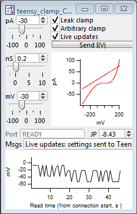

# flex_dynamic_clamp
A flexible, affordable dynamic clamp. It is based on an economical and programmable [microprocessor](https://www.pjrc.com/store/teensy36.html). It extends the designs of [Niraj Desai and colleagues](http://dynamicclamp.com/) by allowing arbitrary conductance waveforms and current-voltage relations, [active electrode compensation](https://www.sciencedirect.com/science/article/pii/S0896627308005394), and automatic calibration.

Dynamic clamp devices mimic the addition (or subtraction) of transmembrane conductances in live cells during whole-cell patch clamp electrophysiology experiments.

This dynamic clamp is inspired by the [paper](http://www.eneuro.org/content/4/5/ENEURO.0250-17.2017) and [designs](http://dynamicclamp.com/) of Niraj Desai, Richard Gray, and Daniel Johnston.
